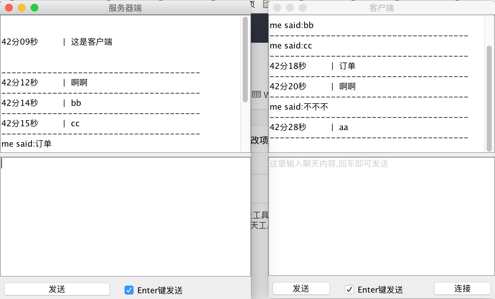

# netty_chat_demo
使用java netty 实现的一个超简易聊天工具,
使用java 原生socket 实现的超简易聊天工具 见https://gitee.com/kunlunsoft/inetAdress_socket.git 

## 参数说明
1. int 占用4个字节;
2. long 占用8个字节

## 工作界面

## 开发工具
IntelliJ IDEA
本项目图形界面使用IntelliJ IDEA 开发,

com/girltest/netty/swing/GenericChatFrame.form 依赖 IntelliJ IDEA

## 快捷键
快捷键:Alt+Enter:触发"Enter键发送"复选框的选中和取消选中(toggle)

## 依赖的jar 包
[依赖jar包](https://github.com/liuyu520/io0007)

## 技术博客
我的GitHub地址:[https://github.com/liuyu520](https://github.com/liuyu520)

我的技术博客:[http://hw1287789687.iteye.com/](http://hw1287789687.iteye.com/)

[http://blog.csdn.net/hw1287789687](http://blog.csdn.net/hw1287789687)